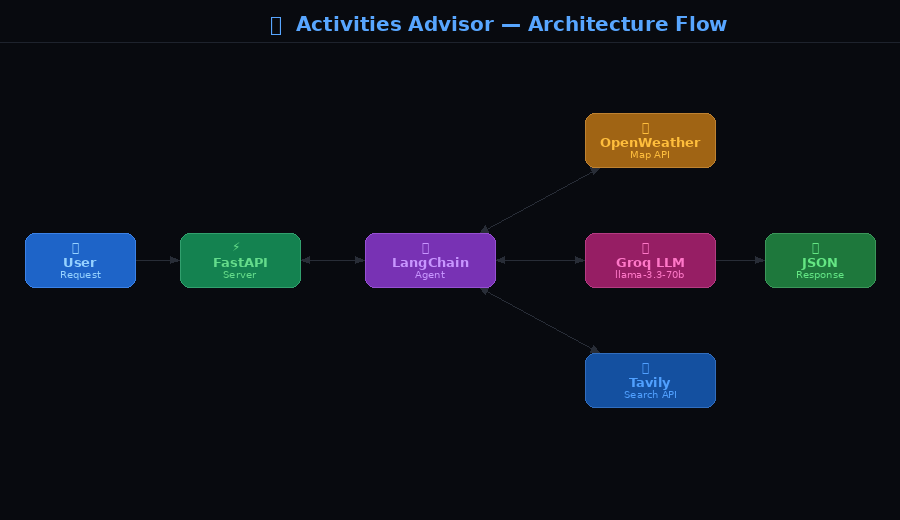
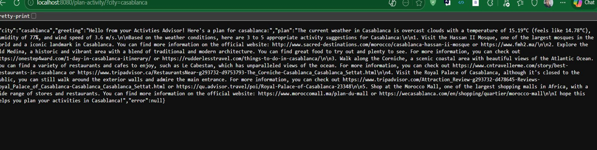
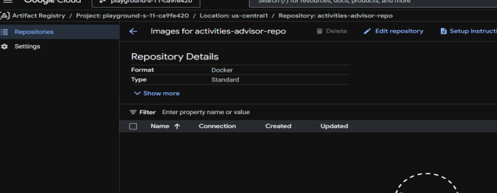
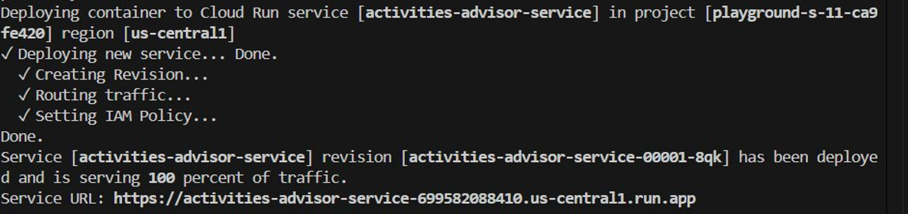
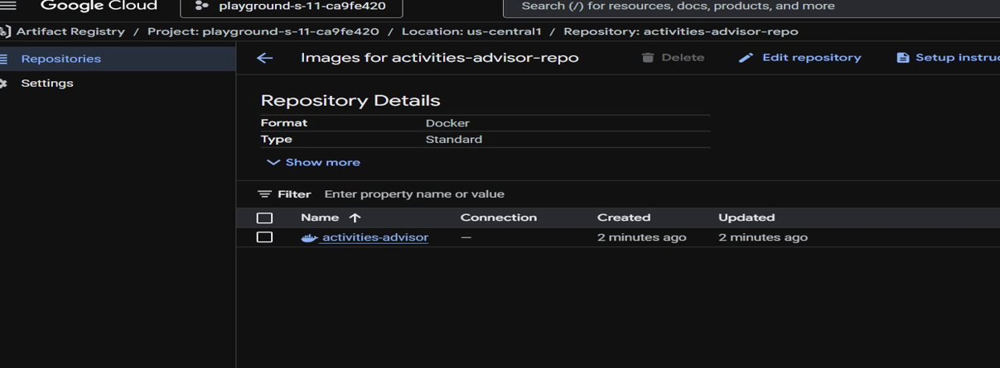
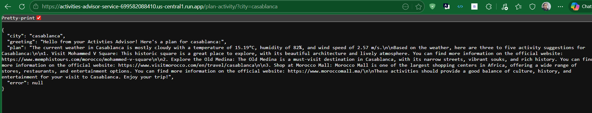

# 🌆 Activities Advisor Agent

An AI-powered FastAPI application that suggests activities for any city based on real-time weather conditions. Built with LangChain, Groq LLM, and deployed on Google Cloud Run.

---

## 🏗️ Architecture

```
User Request → FastAPI → LangChain Agent → OpenWeatherMap API
                                        → Tavily Search API
                                        → Groq LLM (llama-3.3-70b-versatile)
                              ↓
                        Activity Plan Response
```

---

## 🚀 Features

- Real-time weather fetching for any city
- AI-generated activity suggestions based on weather conditions
- Web search integration for activity links and details
- Fully containerized with Docker
- Deployed on Google Cloud Run (serverless)
- CI/CD pipeline with Google Cloud Build

---

## 🛠️ Tech Stack

| Component | Technology |
|-----------|------------|
| Framework | FastAPI |
| LLM | Groq (llama-3.3-70b-versatile) |
| Agent Framework | LangChain |
| Weather API | OpenWeatherMap |
| Search API | Tavily |
| Containerization | Docker |
| Container Registry | Google Artifact Registry |
| Deployment | Google Cloud Run |
| CI/CD | Google Cloud Build |

---

## 📋 Prerequisites

- Python 3.10+
- Docker
- Google Cloud SDK (`gcloud`)
- API keys for: Groq, OpenWeatherMap, Tavily

---

## ⚙️ Local Setup

**1. Install dependencies:**
```bash
pip install -r requirements.txt
```

**2. Create a `.env` file:**
```env
OPENWEATHERMAP_API_KEY=your_openweathermap_key
GROQ_API_KEY=your_groq_key
TAVILY_API_KEY=your_tavily_key
```

**3. Run the application:**
```bash
python main_planner_app.py
```

App will be available at: `http://localhost:8000`

---

## 🐳 Docker

**Build:**
```bash
docker build -t activities-advisor .
```

**Run:**
```bash
docker run \
  -e OPENWEATHERMAP_API_KEY=your_key \
  -e GROQ_API_KEY=your_key \
  -e TAVILY_API_KEY=your_key \
  -p 8080:8000 \
  activities-advisor
```

App will be available at: `http://localhost:8080`

---

## 📡 API Usage

### Endpoint
```
GET /plan-activity/?city={city_name}
```

### Example Request
```
GET /plan-activity/?city=Casablanca
```

### Example Response
```json
{
  "city": "Casablanca",
  "greeting": "Hello from your Activities Advisor! Here's a plan for Casablanca:",
  "plan": "The current weather in Casablanca is partly cloudy with a temperature of 15.19°C...",
  "error": null
}
```

---

## ☁️ Deployment on Google Cloud Run

**1. Authenticate:**
```bash
gcloud auth login
gcloud config set project YOUR_PROJECT_ID
```

**2. Enable required services:**
```bash
gcloud services enable run.googleapis.com
gcloud services enable artifactregistry.googleapis.com
```

**3. Create Artifact Registry repository:**
```bash
gcloud artifacts repositories create activities-advisor-repo \
  --repository-format=docker \
  --location=us-central1
```


**4. Configure Docker authentication:**
```bash
gcloud auth configure-docker us-central1-docker.pkg.dev
```

**5. Build and push image:**
```bash
docker build -t us-central1-docker.pkg.dev/YOUR_PROJECT_ID/activities-advisor-repo/activities-advisor:latest .

docker push us-central1-docker.pkg.dev/YOUR_PROJECT_ID/activities-advisor-repo/activities-advisor:latest
```

**6. Deploy to Cloud Run:**
```bash
gcloud run deploy activities-advisor-service \
  --image us-central1-docker.pkg.dev/YOUR_PROJECT_ID/activities-advisor-repo/activities-advisor:latest \
  --platform managed \
  --region us-central1 \
  --allow-unauthenticated \
  --port 8000 \
  --set-env-vars="OPENWEATHERMAP_API_KEY=your_key,GROQ_API_KEY=your_key,TAVILY_API_KEY=your_key"
```




**7. Access your service:**
```
https://activities-advisor-service-XXXXXXXXXX.us-central1.run.app/plan-activity/?city=Casablanca
```

---

## 🔄 CI/CD Pipeline

The project uses Google Cloud Build for automated deployments. On every trigger, the pipeline will:

1. Build the Docker image
2. Push it to Artifact Registry
3. Deploy the new revision to Cloud Run

The pipeline is configured in `cloudbuild.yaml`.

---

## 📁 Project Structure

```
activities-advisor-agent/
├── main_planner_app.py      # Main FastAPI application
├── requirements.txt         # Python dependencies
├── Dockerfile               # Container configuration
├── cloudbuild.yaml          # CI/CD pipeline
├── .gitignore               # Git ignored files
└── README.md                # This file
```

---

## 🔑 Getting API Keys

| Service | Free Tier | Link |
|---------|-----------|------|
| Groq | 1000 req/day | https://console.groq.com |
| OpenWeatherMap | 1000 req/day | https://openweathermap.org |
| Tavily | 1000 req/month | https://app.tavily.com |

> ⚠️ Never commit your `.env` file or API keys to version control.

---=-- Good luck ---------

## 📄 Created by : Ayman BOUBDIR
